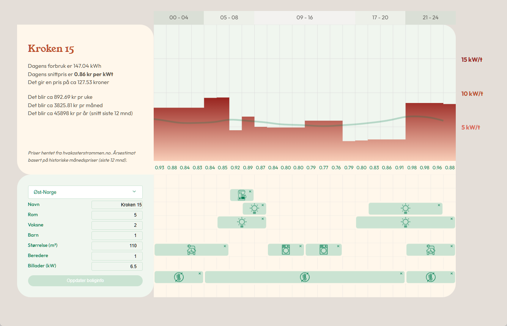

# Interaktiv strømkalkulator

> **Prototype**

Interaktiv visualisering av strømforbruk og lastfordeling i boligen gjennom døgnet.



## Hva gjør appen?

Appen hjelper deg å forstå og planlegge strømforbruket ditt time for time. Du legger inn informasjon om boligen din — navn, antall rom, beboere, størrelse, varmtvannsberedere og elbillader — og får tilbake en oversikt over:

- **Estimert daglig forbruk** i kWh og kroner basert på dagens spotpris
- **Estimert ukentlig, månedlig og årlig kostnad**, der årsestimatet er sesongvektet mot historiske månedspriser
- **Timefordelt lastgraf** som viser forbruksprofilen din over fem tidsbolker (00–04, 05–08, 09–16, 17–20, 21–24)
- **Interaktiv planlegging** — dra og slipp apparater (vaskemaskin, tørketrommel, oppvaskmaskin, varmepumpe, lys m.m.) inn i tidsbolkene for å flytte lasten til billigere timer i døgnet.

Strømprisene hentes fra hvakosterstrommen.no og oppdateres live.

Publisert [her:](https://loadbalance.surge.sh)

## Kom i gang

```bash
pnpm install
pnpm dev
```

## Stack

- React 18 + TypeScript + Vite
- Styled Components + Radix UI
- Nivo (grafer), Konva (canvas-dnd), GSAP (animasjoner)
- Zustand (state)
